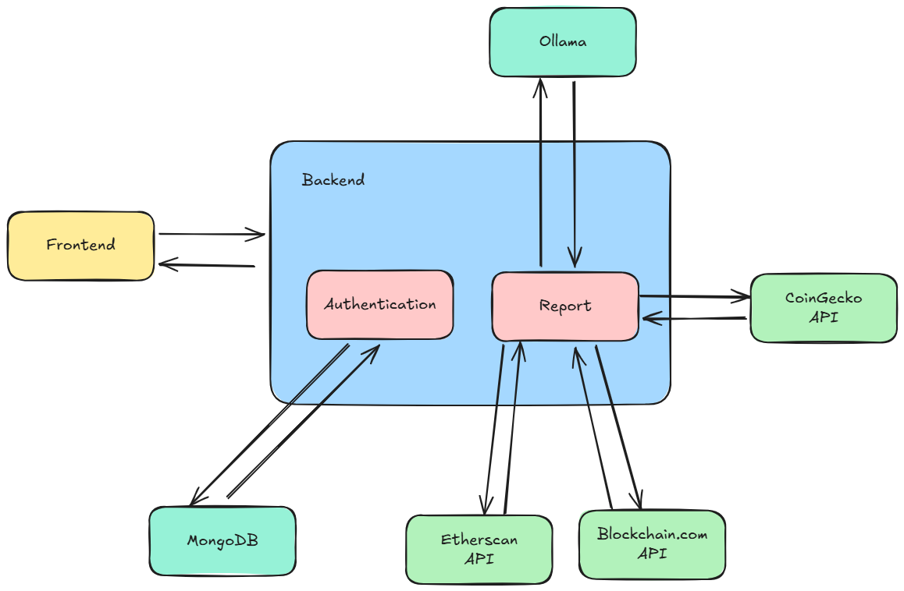

# 💰 Banker Expert – Personal Financial Intelligence

🎯 **Project Purpose**  
This project aims to provide a personalized financial assistant that analyzes user data and delivers comprehensive reports — as if was written by a private banker and senior accountant.

⚙️ **Tech Stack**  
- **Backend:** Node.js (Express)  
- **Authentication Service:** MongoDB  
- **AI Engine:** Tinyllama  
- **Crypto Wallet Integration:** CoinGecko API  
- **Testing:** Jest  
- **Frontend:** React

🧩 **Architecture Overview**  
The system uses a modular monolith architecture — clear separation of services without microservices overheaded:



✅ **Current Features**  
- 🟢 Base Express server running  
- 🟢 Modular services   
- 🟢 Project structured for clarity, testing, and growth  
- 🟢 Crypto wallet connection and analysis
- 🟢 AI-generated financial reports  

🔜 **Coming Soon**  
  
- Full frontend interface (React)    
- Full authentication flow with JWT  


## ⚙️ Installation & Setup

### 📦 Prerequisites
- Node.js
- Git for version control  

### 🔄 Clone the Repository
```bash
git clone
```

**Install dependencies:**
```bash
npm install
```

**Start the server:**
```bash
npm run dev
```


## 📡 API Endpoints

| Method | Endpoint      | Description                           |
|--------|---------------|---------------------------------------|
| POST   | /auth/login   | Authenticate a user                   |
| POST   | /auth/register| Register a user                       |
| POST   | /full-report  | Get personalized report               |


## 📄 License
MIT License


